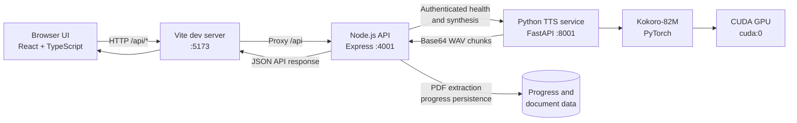
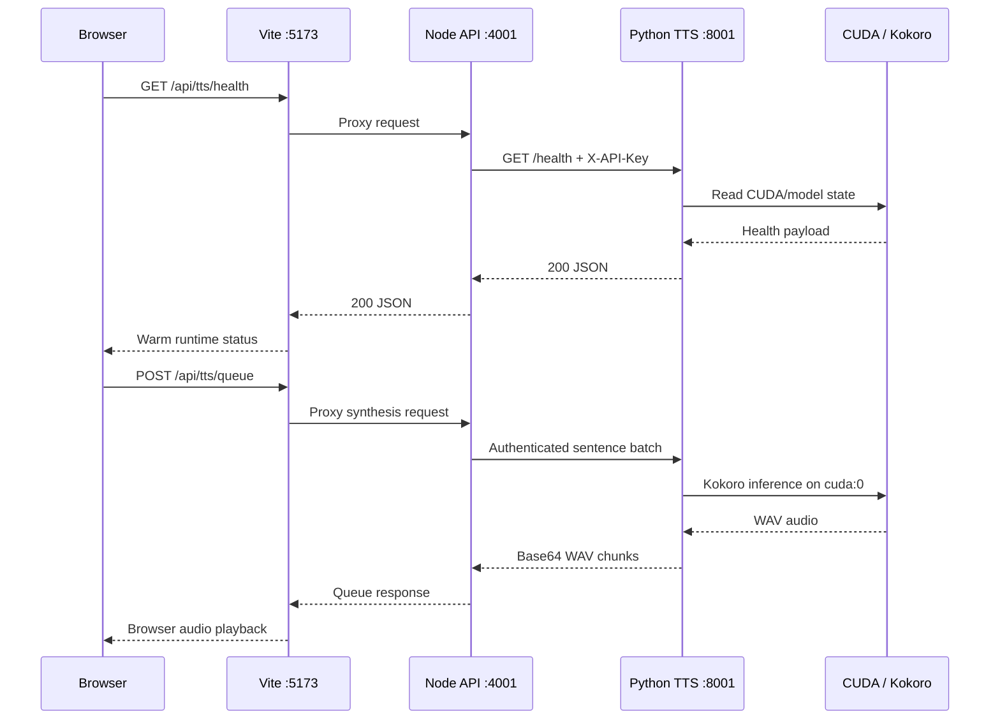

# Architecture Overview

## Full System Architecture

This application is a three-tier local pipeline for turning PDFs into synchronized audiobook playback.



The production Node API can be started on another port with `PORT`, but the
Vite `/api` proxy must target the same port during development. The Python
service remains on its configured `PORT`, and Node reaches it through
`PYTHON_TTS_URL`.

## Runtime Request Flow



## Port and Build Configuration

| Component | Default port | Configuration source |
| --- | ---: | --- |
| Vite frontend | `5173` | `frontend/vite.config.ts` |
| Node API | `4001` | `server/.env:PORT` |
| Python TTS | `8001` | `python-service/.env:PORT` |

Changing the Node port requires two coordinated edits: set `PORT` in
`server/.env` and change the `/api` proxy target in `frontend/vite.config.ts`.
Changing the Python port also requires updating `PYTHON_TTS_URL` in
`server/.env`. The Node and Python API keys must match.

Build the complete project from the repository root with:

```bash
npm install
npm run build
npm test
cd python-service
source .venv/bin/activate
python3 -m py_compile app/*.py
```

`npm run build` compiles the Node API and frontend. The Node output entrypoint
is `server/dist/src/server.js`; Python is validated with `py_compile` because it
does not produce a separate compiled application bundle.

Responsibilities by layer:

1. React frontend
	Renders the PDF canvas, transcript pane, transport controls, progress-aware page navigation, and the `Start from page` workflow.
2. Node.js API
	Validates PDFs, extracts text with pdf.js, segments the text into page-aware sentences, persists progress, and proxies TTS requests.
3. Python TTS service
	Loads Kokoro-82M, checks CUDA availability, warms the model, synthesizes bounded sentence batches, and returns WAV audio chunks.

## Data Flow

End-to-end path:

`PDF -> validation -> extraction -> sentence segmentation -> sentence metadata -> TTS queue request -> Kokoro synthesis -> WAV payload -> browser playback -> progress save`

Detailed sequence:

1. The user uploads a PDF from the browser.
2. The frontend sends multipart form data to `POST /api/documents/upload`.
3. The Node API validates MIME type, PDF header, size, and page limits.
4. Node uses pdf.js to extract text page by page.
5. Node normalizes the text and emits sentence chunks with:
	- `pageNumber`
	- `sentenceIndex`
	- `text`
6. Node returns the parsed document plus any previously saved progress.
7. The frontend renders the current PDF page and the sentences for that page.
8. On play, the frontend sends the next sentence window to `POST /api/tts/queue`.
9. Node authenticates to the Python service and forwards the request.
10. Python synthesizes WAV chunks with Kokoro-82M on `cuda:0`.
11. The frontend converts base64 WAV to `Blob` URLs, plays them through an `Audio()` element, and advances the highlight.
12. The frontend persists `currentPage`, `sentenceIndex`, playback state, and speed.

## Existing Features

### PDF ingestion

- Drag-and-drop or file-input upload from the browser.
- Server-side validation before parsing.

### Text extraction

- pdf.js extraction on the Node side.
- Control-character stripping and whitespace normalization before the UI consumes text.

### Sentence segmentation

- Each sentence is stored in reading order with `pageNumber` and `sentenceIndex`.
- This structure is the shared contract used by the viewer, transcript, queueing logic, and progress restore.

### Audio playback

- The frontend buffers a small upcoming sentence window.
- Playback uses real WAV `Blob` object URLs rather than `data:` URLs.
- The active sentence highlight tracks the current sentence index.
- Queue progression searches forward by `sentenceIndex` in document order and only skips sentences when synthesis returns no playable audio.
- The playback hook uses explicit lifecycle states: `idle`, `loading`, `playing`, `paused`, and `error`.

### GPU acceleration

- Kokoro-82M is loaded through the Python adapter on CUDA.
- The service is validated on an NVIDIA GTX 1080 Ti.

### Progress persistence

- State is keyed by a content-derived `documentId`.
- Reloading the same document restores page, sentence, playback state, and speed.

## New Feature: Start from Page

The implementation is frontend-only and reuses the existing sentence metadata contract.

### UI interaction

- `DocumentReader` now exposes a controlled numeric `Start page` input.
- The `Start from page` button is disabled unless the page is within `1..pageCount`.

### Playback behavior

1. The user enters a page.
2. The frontend validates the page number.
3. `useAudioQueue` calls `findFirstSentenceIndexForPage(sentences, pageNumber)`.
4. If a sentence exists:
	- current playback is paused
	- the current audio source is cleared
	- cached audio object URLs are revoked
	- the queue state is reset
	- playback restarts from the first sentence on that page
5. If no sentence exists:
	- playback stops
	- the PDF viewer still jumps to the page
	- the app exposes a non-blocking message through playback error state

### State synchronization

- `currentPage` is now the shared viewer/playback page anchor.
- `currentSentenceIndex` remains the highlight and queue anchor.
- The PDF viewer effect listens to `currentPage`, so a page-start request moves the canvas immediately even before audio finishes buffering.

### Failure cases

- Invalid input never leaves the UI layer.
- Empty extracted pages do not crash playback.
- Jumping pages while audio is playing triggers a full reset before replay.

## Frontend Deep Dive

### `useAudioQueue`

The queue hook owns playback lifecycle and synchronization:

- Creates and maintains a single `Audio()` instance.
- Buffers synthesis results in a `Map<sentenceIndex, objectUrl>`.
- Revokes stale object URLs when the document changes or the user starts from another page.
- Exposes `startFromPage(pageNumber)` as the page-jump entrypoint.

Implementation highlights:

- `findFirstSentenceIndexForPage(...)` deterministically locates the first sentence for a page.
- `resolvePlaybackPosition(...)` safely clamps restored progress if the saved page or sentence no longer aligns with the current document.
- `resetPlaybackRuntime(...)` centralizes pause and cache cleanup so page jumps do not leave overlapping playback behind or transient empty-source media errors.
- Audio event listeners are attached once per mounted `Audio()` instance and removed exactly once during cleanup.

### `DocumentReader`

The reader now has two responsibilities:

- render the current PDF page with pdf.js
- collect and validate page-start input

Rendering lifecycle:

- pdf.js uses a worker URL aligned with the installed runtime version.
- render requests are serialized with a request id and cancellable render task.
- the canvas is sized with HiDPI-aware internal dimensions and matched CSS dimensions.

Page control behavior:

- `Prev page` and `Next page` still allow browsing.
- `Start from page` delegates only the playback restart to the queue hook.
- The transcript pane shows only the sentences for the visible page.

## Backend Summary

No backend change was required for this feature.

Reason:

- The server already returns the complete ordered sentence list.
- Every sentence already includes `pageNumber` and `sentenceIndex`.
- The frontend can therefore map page selection to playback start without changing any API contract.

This keeps the backend stable and avoids introducing page-specific queue endpoints that would duplicate existing data the client already owns.

## Python TTS Service

The Python service remains sentence-based and page-agnostic.

Flow:

1. `kokoro_adapter.py` resolves config, model, and voice assets.
2. `tts_engine.py` warms the model and serializes synthesis requests.
3. `main.py` exposes authenticated HTTP endpoints.
4. Each request returns WAV audio for a bounded sentence batch.

The new page-start feature does not alter synthesis semantics. It simply changes which sentence index the frontend starts queueing from.
